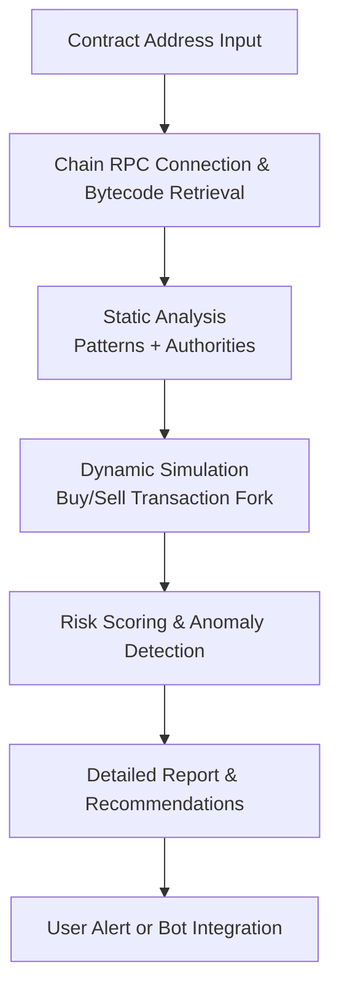

# Contract Safety Bot

Deploy Contract Safety Bot as an on-chain static and dynamic analysis execution layer for detecting honeypots, rug risks, malicious functions, and vulnerabilities in ERC-20, SPL, and other smart contracts before interaction.

### Introduction to Smart Contract Security Tools

The proliferation of new tokens and DeFi protocols increases exposure to malicious contracts. A **Contract Safety Bot** functions as a specialized **static analysis and simulation engine** that evaluates smart contracts for common scam patterns, vulnerabilities, and risky behaviors in real time.

Traders, developers, and DeFi users integrate these tools into their workflow to make informed decisions and avoid financial losses from honeypots, rugs, or exploitable code.

  

### Inside the System: Core Mechanism

The bot operates as a **hybrid static + dynamic analysis layer**. It performs:

- Bytecode and source code pattern matching for blacklists, owner privileges, and hidden fees
- Transaction simulation (buy/sell) to detect sell restrictions or traps
- Liquidity and authority checks (mint, freeze, LP lock status)
- Vulnerability scanning for common exploits and reentrancy risks
- Risk scoring based on heuristics and known scam signatures

Results are delivered with detailed explanations and risk levels for quick decision-making.

### Target Audience and Practical Use Cases

This execution layer targets:
- Memecoin and new token traders
- DeFi users evaluating liquidity pools
- Developers auditing contracts before interaction
- Security researchers and analysts

Common applications include:
- **Pre-purchase token verification** on DEX launches
- **Liquidity pool health checks**
- **Batch scanning** of trending tokens
- **Automated trading bot integration** for safety filters

### Technical Architecture and Operational Logic

A robust Contract Safety Bot includes:

- **Input Layer**: Contract address and chain identifier
- **Static Analysis Engine**: Bytecode decompilation and pattern detection
- **Dynamic Simulation Module**: Forked state buy/sell testing
- **Risk Scoring System**: Weighted heuristics and confidence levels
- **Reporting Dashboard**: Clear flags, explanations, and recommendations

**Operational Logic Flowchart**

### Key Features and Technical Advantages

- **Multi-Chain Support**: Ethereum, Solana, Base, BSC, and major EVM/L2s
- **Simulation-Based Detection**: Most accurate for runtime honeypot behavior
- **Comprehensive Checks**: Taxes, blacklists, ownership, LP locks, and more
- **Fast Scanning**: Results in seconds for real-time decision-making
- **Integration Ready**: API support for trading bots and dashboards

The system provides higher accuracy than manual review by combining static patterns with live simulation.

### Deployment Profile and Getting Started

1. **Tool Selection**: Choose web-based, API, or self-hosted solutions based on volume.
2. **Basic Usage**: Enter contract address and chain for instant analysis.
3. **Integration**: Connect APIs to trading bots or custom dashboards.
4. **Workflow**: Combine with liquidity and team checks for complete due diligence.
5. **Advanced Use**: Run batch scans or set up continuous monitoring for watchlists.

Open-source and commercial options provide various levels of customization.

### Conclusion

The Contract Safety Bot serves as an essential risk analysis execution layer for navigating the high-risk environment of new smart contracts and tokens. Its combination of static analysis, dynamic simulation, and clear reporting helps users make more informed decisions. For traders and developers who use it as part of a broader due diligence process, it significantly reduces exposure to common scams and vulnerabilities.

### FAQ

**How accurate are Contract Safety Bots?**  
They are highly effective at detecting common patterns and runtime issues but are not foolproof. Always combine with manual review and multiple tools.

**Do they work on Solana contracts?**  
Yes. Specialized checkers analyze token authorities, metadata, and swap simulations for Solana programs.

**Can a contract pass a check and still be malicious?**  
Yes. Dynamic or time-based malicious logic can activate after scanning. Treat all new contracts as high-risk.

**Are these bots free to use?**  
Many public web checkers are free for basic scans. Advanced API access or self-hosted versions may involve costs.

**How does a Contract Safety Bot compare to full audits?**  
Bots provide fast, automated surface-level detection. Professional audits offer deep manual review of logic, economics, and long-term security for critical projects. Use both when appropriate.
